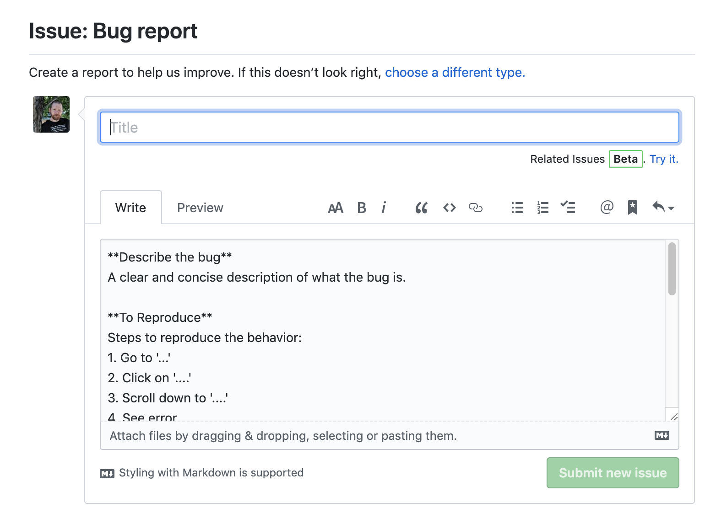

# Contributing to Phantom

Thank you for considering spending your time contributing to Phantom Apps. Whether you're interested in bug-hunting, documentation, or creating entirely new apps, this document will help and guide you through the process.

If you've stumbled upon the site but don't know who or what we are, please check out the links below:
- [Splunk > Phantom](https://www.splunk.com/en_us/software/splunk-security-orchestration-and-automation.html) - Home Page of Phantom
- [Phantom Community](https://my.phantom.us) - Phantom Community site

---

## First Steps
Make sure you have a [GitHub Account](https://www.github.com)
- Make sure you know how Git works.
    - [Git Book](https://git-scm.com/book/en/v2)
    - [Git Handbook](https://guides.github.com/introduction/git-handbook/)
    - [GitHub Git Guide](https://help.github.com/en/articles/git-and-github-learning-resources)
    - [Git Workflow](https://guides.github.com/introduction/flow/)
    - [Git Visualization](http://git-school.github.io/visualizing-git/) -> Super cool!

## Project Details
To successfully contribute, you should spend a little time familiarizing yourself with the following key topics.

- [Coding Conventions](https://about:blank) - How we expect to see code formatted
- [Naming Conventions](https://about:blank) - How Issues, Branches, and PRs should be named
- [Certified vs Standard App](https://about:blank) definitions and differences
- [Typical developer workflow](https://about:blank) - Configuring your dev environment
- [Testing Details](https://about:blank) - How we test apps & playbooks

## Notifying us of Issues
If you've found a problem but don't want to contribute a fix, that's ok! All you need to do is go to the `Issues` section of the Repo and click 'New Issue'. This will show our conviniently set-up Issue templates. 

All you have to do is fill out the form...

 

...and it'll get reviewed and priortized by our developers and maybe even someone in our community.

Of course before you do this, you should definitely check if there is already an open issue and if so, add a thumbs-up reaction to it so we can get a sense of how to prioritize it.

## Contributing Bug-fixes
If you've found a bug and wish to fix it, the first thing to do is 

1. [Fork](https://guides.github.com/activities/forking/) the project
1. Create a branch for the issue (following our [Naming Conventions](https://(about:blank)))
1. Make your changes on your branch
1. Thoroughly test your changes
1. Perform a [pull request](https://help.github.com/articles/using-pull-requests/)

Remember:  One issue per branch. We will not accept any Pull Requests that affect more than one App or addresses more than one Issue at a time (unless the issue is a duplicate - discretion of our development team).

## Contributing New Apps